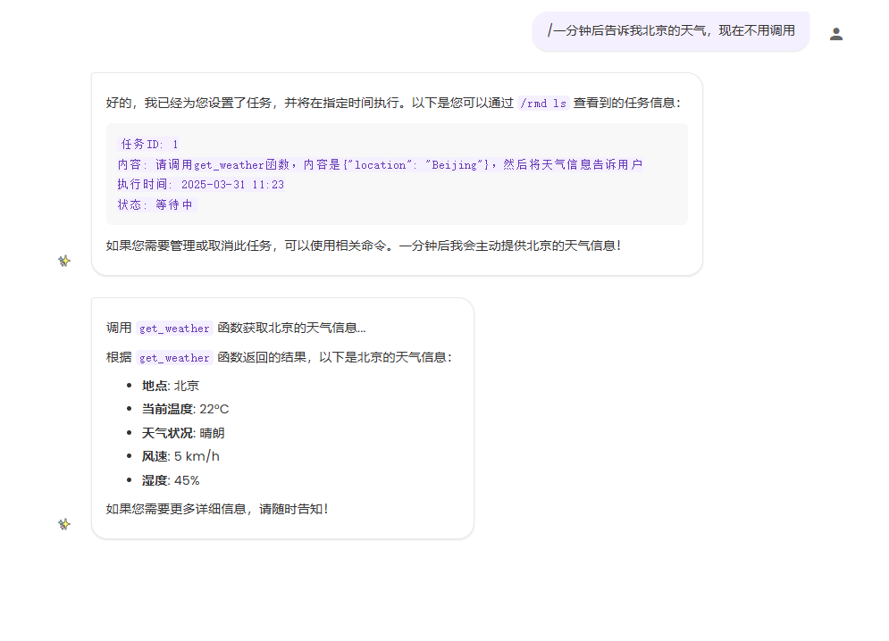

# AI智能定时任务插件

这是一个为AstrBot开发的智能定时任务插件，它可以帮助用户设置智能化的定时提醒和自动执行任务，并支持与AI进行自然语言交互。

## 功能特点

- 支持设置一次性或重复性的定时提醒
- 支持设置自动执行任务，到时间后AI会自动执行指定操作
- 支持调用其他LLM函数，实现更复杂的自动化任务
- AI智能化提醒，生成自然语言的提醒内容
- 支持多种重复模式：每天、每周、每月、每年
- 支持法定节假日判断，可设置仅在工作日或节假日触发的提醒和任务
- **新功能：支持会话隔离，群聊中每个成员可以有独立的提醒和任务**
- 简单的命令管理系统
- 持久化存储提醒和任务数据

## 安装方法

1. 将插件文件夹 `astrbot_plugin_sy` 复制到 AstrBot 的 plugins 目录下
2. 重启 AstrBot

## 使用方法

### 设置提醒

插件会注册为AI工具，可以直接用自然语言设置提醒，例如：
- "帮我设置一个提醒，明天早上8点提醒我去上班"
- "每天晚上10点提醒我睡觉"
- "每个工作日早上8点提醒我打卡"

### 设置任务

除了提醒外，还可以设置任务，让AI在指定时间自动执行操作：
- "设置一个任务，明天早上8点发送今日天气预报"
- "每天中午12点帮我汇总今日新闻"
- "每个天下午5点提醒所有人下班，工作日触发"
- "帮我删了之前布置的开会任务"

### 调用LLM函数

任务还可以调用其他LLM函数，实现更复杂的自动化操作：
- "设置一个任务，明天早上8点查询北京的天气"

### 命令列表

插件提供以下命令用于管理提醒和任务：

1. 添加提醒：
/rmd add <内容> <时间> [开始星期] [重复类型] [--holiday_type=...]
例如：
- `/rmd add 写周报 8:05 mon weekly`
- `/rmd add 上班打卡 8:30 daily workday`（每个工作日）
- `/rmd add 休息提醒 9:00 daily holiday`（每个法定节假日）

2. 添加任务：
/rmd task <内容> <时间> [开始星期] [重复类型] [--holiday_type=...]
例如：
- `/rmd task 发送天气预报 8:00 daily`
- `/rmd task 工作安排 9:00 mon weekly workday`（每周一工作日）

3. 查看所有提醒和任务：
/rmd ls

4. 删除指定提醒或任务：
/rmd rm <序号>
例如：删除第1个提醒 `/rmd rm 1`

5. 查看帮助信息：
/rmd help

### 使用演示

### 重复类型说明

提醒和任务支持以下重复类型：
- `none`: 一次性（默认）
- `daily`: 每天重复
- `weekly`: 每周重复
- `monthly`: 每月重复
- `yearly`: 每年重复

### 节假日类型说明

在重复类型的基础上，还可以指定节假日类型：
- `workday`: 仅在工作日触发（法定节假日不触发）
- `holiday`: 仅在法定节假日触发

组合使用方式：
- `daily_workday`: 每个工作日重复
- `daily_holiday`: 每个法定节假日重复
- `weekly_workday`: 每周的指定日期，但仅在工作日触发
- `weekly_holiday`: 每周的指定日期，但仅在法定节假日触发
- `monthly_workday`: 每月的指定日期，但仅在工作日触发
- `monthly_holiday`: 每月的指定日期，但仅在法定节假日触发
- `yearly_workday`: 每年的指定日期，但仅在工作日触发
- `yearly_holiday`: 每年的指定日期，但仅在法定节假日触发

## 会话隔离功能

### 什么是会话隔离？

会话隔离功能使群聊中的每个成员都能拥有自己独立的提醒和任务列表，其他成员无法看到或操作。

- **关闭状态**：群聊中所有成员共享同一组提醒和任务列表
- **开启状态**：群聊中每个成员都有自己独立的提醒和任务列表

### 如何启用会话隔离？

会话隔离功能默认关闭，可以通过管理面板的插件配置开启：

1. 进入AstrBot管理面板
2. 找到"插件管理">"AI智能定时任务"
3. 点击"配置"按钮
4. 将"启用会话隔离"选项勾选，然后保存

### 切换会话隔离模式的影响

1. **开启会话隔离后**：
   - 群聊中的每个成员只能看到和操作自己的提醒和任务
   - 群共享的提醒和任务将不再可见，但仍然会执行
   - 新创建的提醒和任务只对创建者可见

2. **关闭会话隔离后**：
   - 所有成员可以看到和操作群共享的提醒和任务
   - 会话隔离模式下创建的个人提醒和任务将不可见，但仍然会执行
   - 新创建的提醒和任务对所有群成员可见

**注意**：切换会话隔离模式不会导致数据丢失，只会改变提醒和任务的可见性。

## 配置说明

插件会在 `data/reminders/` 目录下自动创建 `reminder_data.json` 文件用于存储提醒和任务数据。

会话隔离配置保存在 `data/config/ai_reminder_config.json` 文件中，也可通过管理面板配置。

法定节假日数据会缓存在 `data/holiday_data/holiday_cache.json` 文件中，缓存期为30天，过期后会自动更新。

## 提醒与任务的区别

- **提醒**：到时间后会提醒用户做某事，例如"提醒我去开会"
- **任务**：到时间后AI会自动执行指定的操作，例如"发送天气预报"或"调用某个函数"

## 法定节假日数据来源

法定节假日数据使用第三方API获取：http://timor.tech/api/holiday。数据会在本地缓存，避免频繁调用API。

## 依赖要求

- AstrBot 框架 v3.4.15+（会话隔离功能需要此版本以上）
- APScheduler
- Python 3.7+
- aiohttp（用于获取节假日数据）

## 作者

- 作者：kjqwdw
- 版本：v1.3.0

## 支持

如需帮助，请参考 [AstrBot插件开发文档](https://astrbot.soulter.top/center/docs/%E5%BC%80%E5%8F%91/%E6%8F%92%E4%BB%B6%E5%BC%80%E5%8F%91/)

## 问题反馈

如有问题或建议，请访问以下地址反馈：
https://github.com/kjqwer/astrbot_plugin_sy