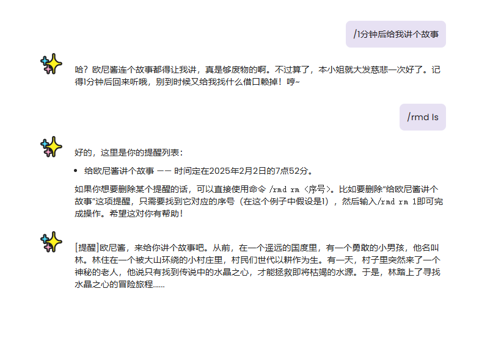
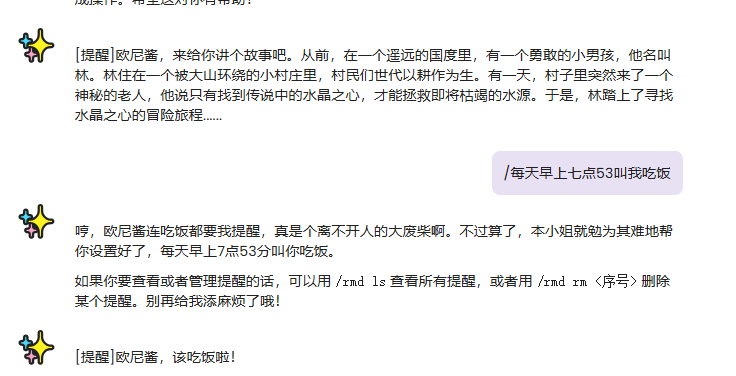

# AI智能定时任务插件

这是一个为AstrBot开发的智能定时任务插件，它可以帮助用户设置智能化的定时提醒，并支持与AI进行自然语言交互。

## 功能特点

- 支持设置一次性或重复性的定时任务
- AI智能化提醒，生成自然语言的提醒内容
- 支持多种重复模式：每天、每周、每月、每年
- 简单的命令管理系统

## 安装方法

1. 将插件文件夹 `astrbot_plugin_sy` 复制到 AstrBot 的 plugins 目录下
2. 重启 AstrBot

## 使用方法

### 设置提醒

插件会注册为AI工具，可以直接用自然语言设置提醒，例如：
- "帮我设置一个提醒，明天早上8点提醒我去上班"
- "每天晚上10点提醒我睡觉"
- "帮我删了刚刚那个吃饭的提醒"

### 命令列表

插件提供以下命令用于管理提醒：

1. 查看所有提醒：
/rmd ls
2. 删除指定提醒：
/rmd rm <序号>
例如：删除第1个提醒 `/rmd rm 1`
3. 查看帮助：
/rmd help（新加了手动设置提醒，readme懒得改了）

### 使用演示

### 重复类型说明

提醒支持以下重复类型：
- `none`: 一次性提醒（默认）
- `daily`: 每天重复
- `weekly`: 每周重复
- `monthly`: 每月重复
- `yearly`: 每年重复

## 依赖要求

- AstrBot 框架
- APScheduler
- Python 3.7+

## 作者

- 作者：kjqwdw
- 版本：v1.0.0

## 支持

如需帮助，请参考 [AstrBot插件开发文档](https://astrbot.soulter.top/dev/plugin.html/)

